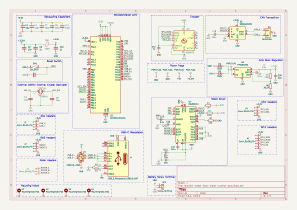
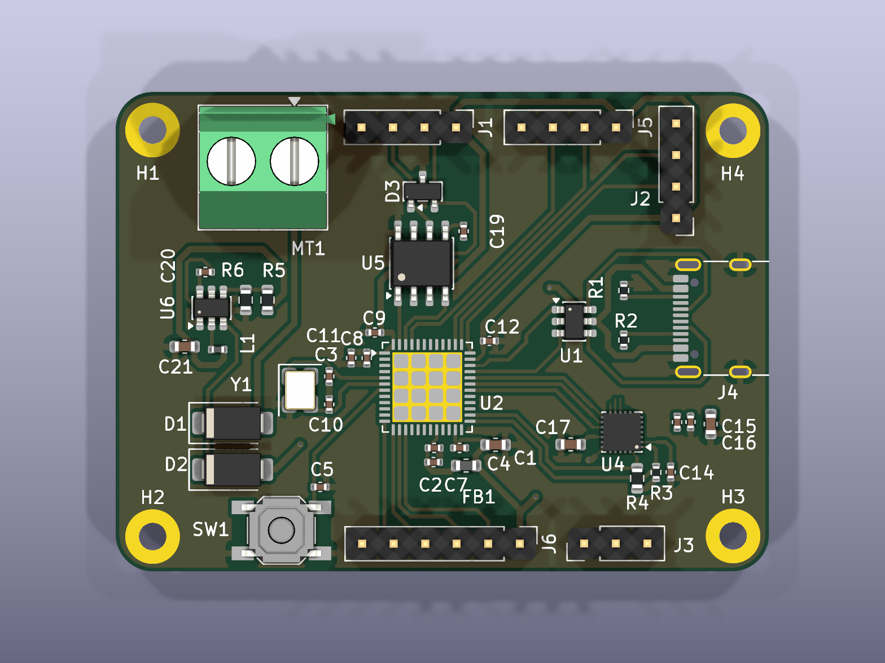

# Reaction Wheel BLDC Motor Control PCB

## Schematic



## PCB




## Key Components

| Reference | Part | Function |
|-----------|------|----------|
| U2 | STM32G431CBUx | Cortex-M4 motor-control MCU (QFN-48) |
| U4 | DRV8311H | Three-phase BLDC gate driver / motor driver |
| U3 | AS5047D | Magnetic rotary position (angle) sensor |
| U5 | SN65HVD231 | CAN transceiver |
| U6 | TPS562200 | Step-down (buck) converter |
| U1 | USBLC6-2SC6 | USB ESD protection |
| D3 | NUP2105L | CAN bus ESD protection |
| Y1 | 16 MHz crystal | MCU clock source |
| J4 | USB-C receptacle | Power + USB 2.0 data |
| MT1 | Phoenix screw terminal | Motor power input |

### Connectors & I/O

- **J4** — USB-C (USB 2.0 + power)
- **MT1** — 2-pin screw terminal (motor phases / power)
- **J1, J2, J5** — 1x4 pin headers
- **J3** — 1x3 pin header
- **J6** — 1x6 pin header
- **SW1** — SPST tactile button

### Passives & Discretes

- **Capacitors:** 10n, 10p, 100n, 0.1u, 1u, 4.7u, 10u, 22u (0402 / 0603 SMD)
- **Inductors:** 2.2u (0402), 120R ferrite bead (FB1)
- **Resistors:** 5k1, 10k, 30.1k, 100k (0402 / 0603 SMD)
- **Diodes:** SS34 Schottky (D1, D2)

> A full bill of materials can be regenerated from the schematic with:
> ```
> kicad-cli sch export bom reaction-wheel-bldc-motor-control-pcb.kicad_sch -o bom.csv
> ```

## Design Files

- `reaction-wheel-bldc-motor-control-pcb.kicad_sch` — schematic
- `reaction-wheel-bldc-motor-control-pcb.kicad_pcb` — PCB layout
- `reaction-wheel-bldc-motor-control-pcb.kicad_pro` — KiCad project

Designed with **KiCad 10**.
